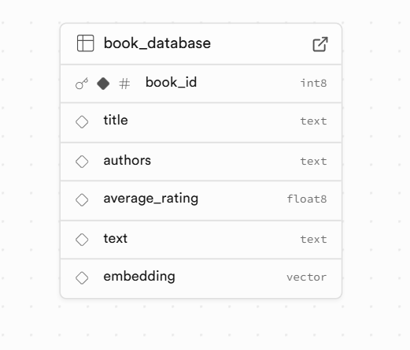

# 📚 Book Recommendation Chatbot

A semantic search-powered book recommendation system built using **FastAPI**, **Sentence Transformers**,** T5 and OpenAI Transformers** and **Supabase**. The chatbot takes natural language queries like _"suggest me some romantic books"_ and returns relevant book recommendations from the [Goodbooks-10k dataset](https://github.com/zygmuntz/goodbooks-10k).

---

## 🚀 Features

- 🔍 Semantic search using Sentence Transformers (`all-MiniLM-L6-v2`)
- 🧠 Top-k book recommendations based on vector similarity
- 🤖 LLM-powered chatbot that crafts user-friendly responses
- 📡 FastAPI backend to handle queries and return results
- 🛢️ Supabase PostgreSQL with `pgvector` extension for vector storage
- 🔄 n8n workflow integration (for automation and logging)

---

## 🗂️ Project Structure

Recommendation_Engine/
│
├── app/ # Core logic
│ ├── model.py # Embedding model & Supabase sync
│ ├── recommender.py # Top-k recommendation logic
├── Screenshots   # see screenshots inside it 
├── data/ # Dataset and preprocessed files
│ └── cleaned_book_dataset.csv (many but final csv file this in use)
│
├── main.py # FastAPI entry point
├── requirements.txt # Python dependencies
├── README.md # This file
└── .env # Environment variables (API keys, DB URL)


```
## 📱 Screenshots
---


  **Database Structure:** can see columns associated with database.

![Frontend](Screenshotschat


---

## ⚙️ Installation

```bash
# Clone the repository
git clone https://github.com/nishchalacharya/Book-Recommend-Chatbot.git
cd Book-Recommend-Chatbot

# Create and activate virtual environment
python -m venv venv
source venv/bin/activate          # On Windows: venv\Scripts\activate

# Install required packages
pip install -r requirements.txt

# Run the App
uvicorn main:app --reload


